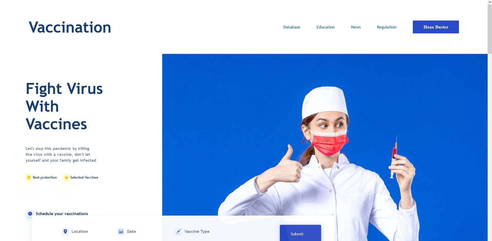
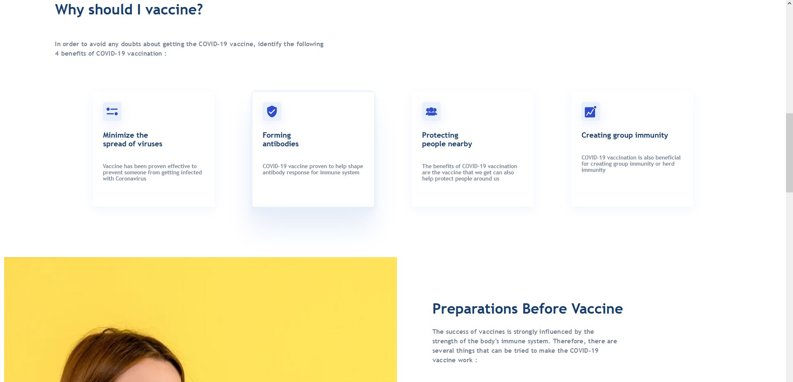
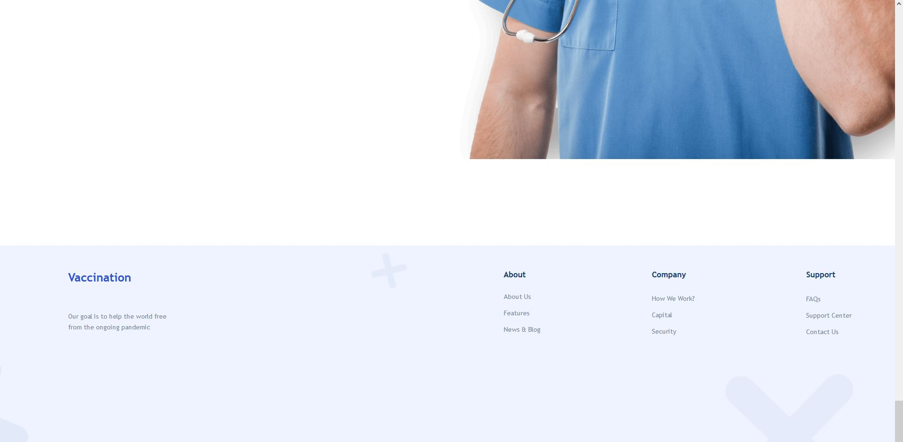

## **Práctica CSS**
 

Para esta práctica necesito que clonen la página que está en el siguiente enlace [Link del diseño](./landingVacunaci%C3%B3n.png) by [Adhiari Subekti](https://dribbble.com/Adhiari_is)

## La práctica consiste en lo siguiente:

- Maquetación del sitio con HTML
- Estilos con CSS (Lo más acercado posible, pueden ser otras imágenes, íconos o colores, pero tiene que ser lo más cercano que puedas)

Bonus:
- Bonus de diseños o páginas adicionales (Totalmente a tu creatividad)

###### Pagina

